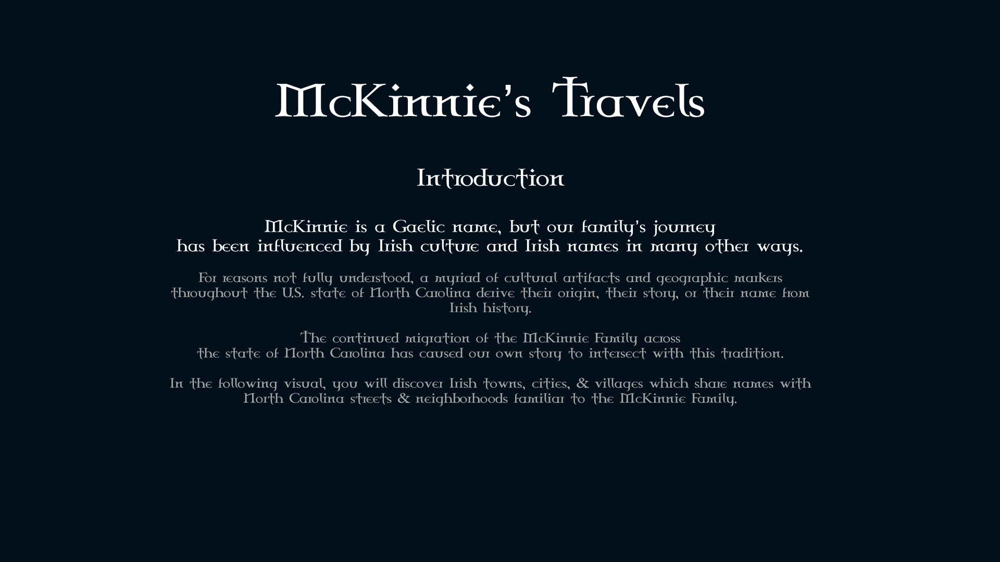
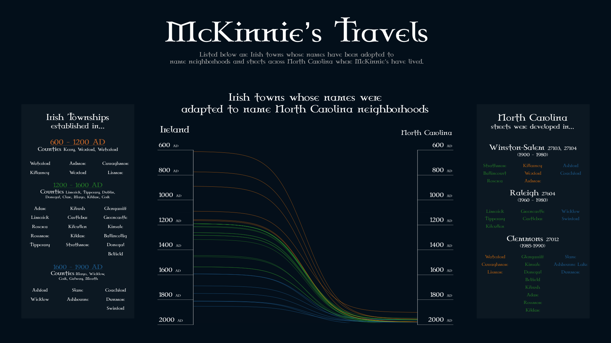
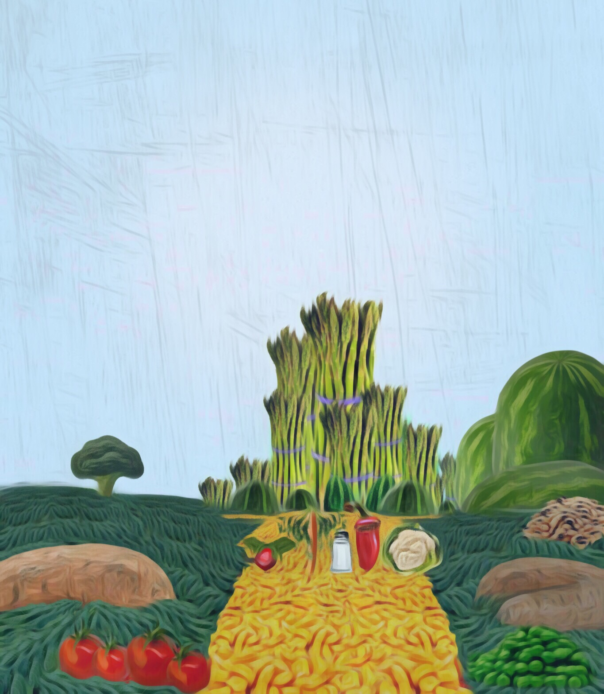

  

Hi World!
I’m Robin McKinnie and I'm a data analyst and information designer working in Austin,TX. 

When I'm not working on a fun side project or sharpening my design skills,
I am scouring the city for new parks and old funk records.

# Work Samples

## Information Design

### McKinnie's Travels

> In 2018, I had the privilege of working in the Republic of Ireland for several months. I am originally from North Carolina, and after bringing some family out to visit, I noticed an astounding number of Irish townships that shared names with prominent streets and neighborhoods in several North Carolina cities. With data collection help from family members, I created a visualization which connects a significant number of Irish towns to North Carolina streets that were likely named after them.

The visualization technique was inspired by [this visualization by _Information is Beautiful_](https://informationisbeautiful.net/visualizations/what-islamic-golden-age-thinkers-discovered-long-before-the-west/)

You can download visualization at original quality [here](https://github.com/rbmckinnie/Robin-McKinnie/raw/master/Information_Design/Travels/McKinnie_Travels_Portfolio.pdf)

_McKinnie's Travels [Intro] (2018-2019)_

_McKinnie's Travels [Visualization] (2018-2019)_

## Graphic Art

### Oz Revisited
_Oz Revisited: 1_ (2016-2017)

_Oz Revisited: 2_ (2016-2017)

